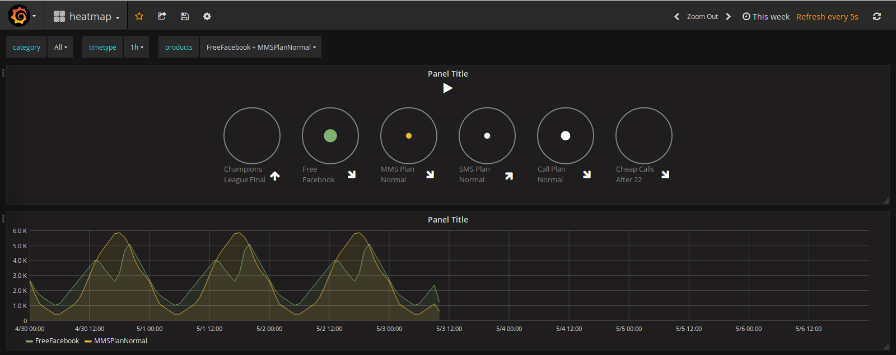
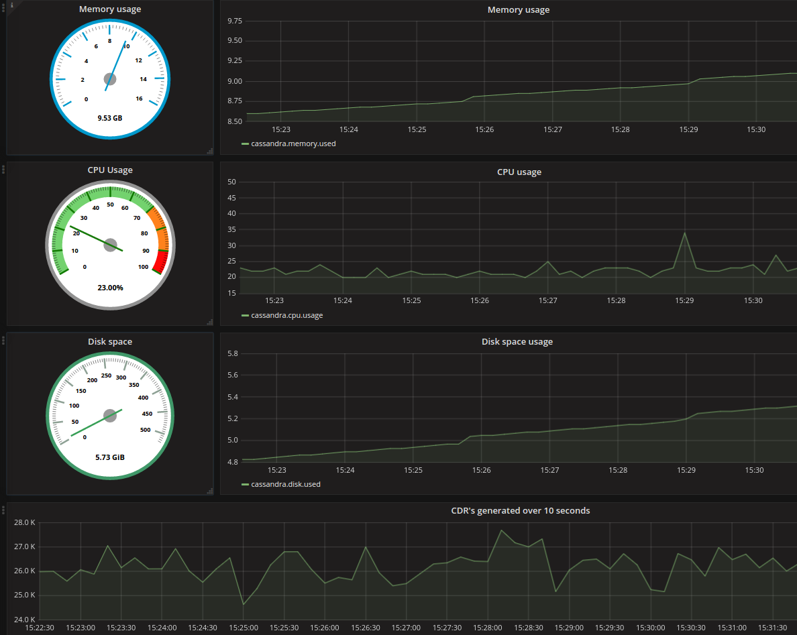

[](https://travis-ci.com/flygare/QvantelFrontend)

# Qvantel Frontend
This repository contains Grafana plugins, the included plugins are the GeoMap panel plugin and the Heatmap plugin. Here, we'll also go through how to install the plugins into Grafana, and how to set them up so they work properly. Both plugins support retrieving data from a Graphite data source. The plugin may work with other data sources, but we this has not been tested.

## GeoMap panel plugin
The GeoMap panel plugin visualizes roaming calls for each country. Each country will receive a color based on their frequency of roaming calls and the color is determined by a color gradient. If a country has less frequency, its color will be picked on the left hand side of the gradient. Documentation for this plugin can be found [here](geomap_panel#geomap-panel-plugin-for-grafana).


## Heatmap panel plugin
The heatmap panel contains functionality to visualize product usage and lapse through time to see how the products usage have changed. Documentation for this plugin can be found [here](heatmap_panel).




## Cassandra Health plugin
Cassandra Health plugin provides you with an overview performance visualization of your server.
Predefined dashboard currently displays:
- Memory usage
- CPU performance usage
- Disk space usage
- Amount of CDR's generated

Documentation for this plugin can be found [here](cassandra_health_panel).




## Plugin installation
To install a plugin you'll need to download the folder for the wanted plugin found in this repository. If you want to install the GeoMap panel plugin, you need to download the **geomap_panel** folder, if you want to install the Heatmap plugin, you need to download the **heatmap_panel** folder and if you want to install the Cassandra Health Metrics dashboard you need to download the **cassandra_health_panel** folder.

The script **containers.sh** in our [main repository](https://github.com/flygare/Qvantel) will start all backend containers and Grafana container where both of the panels are installed.

### Manual setup
When you have downloaded the folder you want, move the folder into the **plugins** folder found inside the Grafana directory. Just move the folder manually or execute a command line to do it for you:
```
cp -fr CURRENT_PLUGIN_FOLDER_LOCATION YOUR_GRAFANA_PLUGIN_FOLDER_LOCATION
```
When the folder is in the correct place, you'll need to open up the terminal and navigate the downloaded plugin folder. You will now need to install all the dependencies for the plugin, for this we're using **npm**.
```
npm install
```
Now that we have all the dependencies needed, we will need to build the plugin, this is done using **grunt**.
```
grunt
```

### Automatic setup
This can also be done automatically by executing the **install.sh** script. This script will move the files to the Grafana plugin folder, install dependencies with npm and build the plugin with grunt. The script accepts a location parameter, this parameter will need to point to your Grafanas plugin folder. If the location parameter is not present, it will try to move the folder to **$HOME/grafana/plugins**.
```
./install.sh YOUR_GRAFANA_PLUGIN_FOLDER_LOCATION
```

Note: If you're running Grafana in a docker container, you'll need to restart the container in order for the plugin to show up.

## Data source setup
In order for your plugin to retrieve data, you'll need to setup a data source. We're currently only supporting Graphite as a data source. Other data sources may work, but we can't guarantee it.

To setup a data source, make sure you're logged into an account with administration access, click the Grafana icon and navigate to the **Data Sources** option.

Click the button that's labeled **Add data source** and you will be redirected to a new page where you can add your data source.

Fill in your credentials and press the Save & Test button. Grafana will check that the credentials are correct and that the data source can be found. As mentioned previously, we recommend that you use a Graphite data source.

## Dashboard setup
When a datasource is setup and the panels are installed you have to create dashboards for using the panels. This can be done manually or by importing json-files. We have provided json-files in our repository that contain our preferred dashboards. These dashboards contain the specific queries and templates needed for all features of our panels. We recommend using these dashboards and then modifying them however you like.

### Automatic setup
To import our dashboards navigate to the dashboards menu next to the main Grafana menu in the top left corner. Press **import** at the bottom of the menu and a new window will appear. Next, press the **Upload .json File** button. You will find our dashboards in our repository at **Qvantel/QvantelFrontend/config/dashboards**.

The dashboards that we have are one for the GeoMap panel, one for the Heatmap panel and a Home panel for easely navigating to either of these. Note that the GeoMap panel and Heatmap panel must be imported and named according to our json-files to function properly.

### Manual setup
To display the plugin you have to setup a dashboard. To do this, you will need to open up Grafana in your web browser and login to an account with administration access. When you're logged in, you can see a Grafana icon in the top left corner, click the icon and a dropdown will appear. Here you can see several options, but the one we want is the **Dashboards** option. A submenu will appear and here you'll want to navigate to **New**.

You will now see a list of plugins in a horizontal list, locate the plugin you installed and drag and drop it into the panel that says **Empty Space**.

You should now see the plugin displayed inside the panel you dropped the plugin into. You will now need to add a data source in order to retrieve data for the plugin.

If your data source is setup, you'll want to access the **Metrics** for the dashboard. Click the titel of the panel and menu will appear, click the **Edit** option and a new section below the dashboard will appear. You will now see a set of tabs. The amount may vary depending on your plugin, but the tab we're currently interested in is the **Metrics** tab. Here, you'll be able to setup the query for your data source. This query will be specific to the plugin you're using.

To setup the Graphite query for the plugin, please see the documentation for the respective plugin: [GeoMap documentation](geomap_panel#metrics) and [Heatmap documentation](heatmap_panel#metrics)

## Grafana themes
Grafana also supports different themes. The default is the dark theme. If you'd rather want a lighter theme you can change it.

To achieve this, press the Grafan icon to the top left corner, hover your profile and navigate to **Preferences**. Here you can see several sections, but in the **Preferences** section, there is an option called **UI Theme**. Select the theme you prefer and press the **Update** button. The plugins should respond to which theme is being used and change their default color scheme.

## Annotations
Annotations are used to display events on the timelines for the heat and worldmap.
Documentation on how to use annotations can be found [here](annotations.md).
