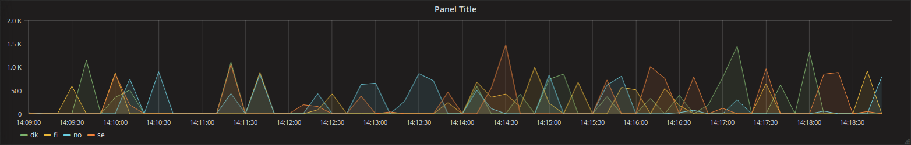
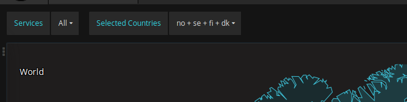
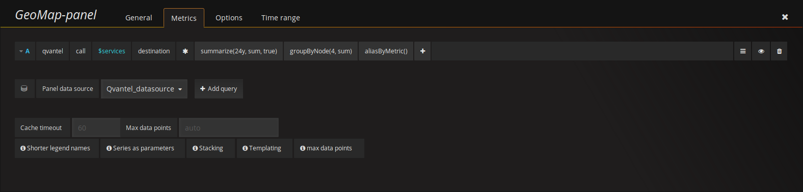
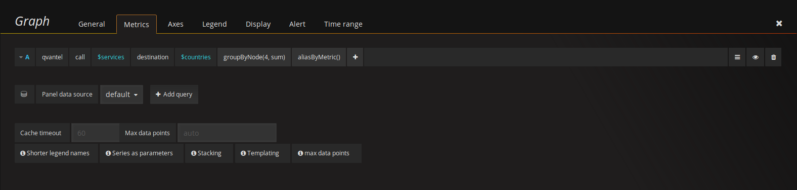
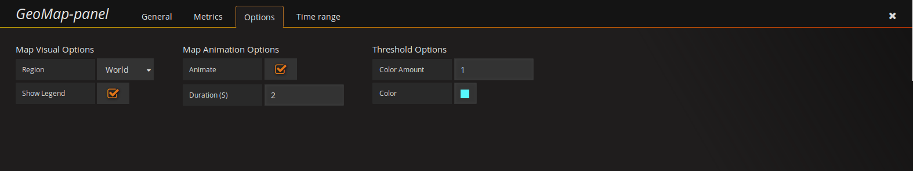

## GeoMap Panel plugin for Grafana

This plugin visualizes roaming calls for each country. This is achieved by using the map service from Google GeoCharts. The location data is retrieved from a Graphite data source.

There is also a graph representing a timeline, where you more specifically can see the amount calls for the selected countries.

### How to use
When loading up the plugin, you'll initially see a world map with colorized countries (if data is present). The color represents the frequency of a countrys roaming calls compared to the other countries currently displayed on the map. 

In the bottom left corner you'll see a legend with a color gradient, a minimum and a maximum value. The color of each country will be determined by using this scale. A country with a frequency closer to the minimum value will recieve a color close to the left hand side of the gradient.

A country's frequency can be more clearly seen by hovering the mouse hover a specific country, a popup will appear displaying its frequency of roaming calls. A country must have data in order for the popup to show.

You can also zoom into the map by clicking on a region. The zooming will occur in several steps, let's say that you click on the country Sweden and you're current zoom state is the world. When clicking Sweden, you'd get zoomed into Europe. Clicking Sweden again (when zoomed into Europe), the map would zoom into Northern Europe and by clicking Sweden once again, you'd now be zoomed into Sweden. 

In the top left corner, you can find a breadcrumb that displays your current zoom state. If you click an item in the breadcrumbs, you will be zoomed out to the clicked region.

You can select or deselect countries by pressing the ctrl or shift key on your keyboard and then clicking on a country with your mouse. The selected countries will be display in the top left corner, but more important, the country will be present in the timeline graph showing the amount of calls.

You can also in top left corner see options to select or deselect services. Selecting specific services will let you filter the data by services, the currently available services are roaming calls via sms, voice, data and mms.

### Metrics
In order to retrieve data to the plugin you'll need to setup a data source. The data source will need to send a country code and a value for that specific country. The value will represent the frequency of the country. We currently only support a Graphite data source, other data sources may work, but we can't guarantee it.

To setup a data source, please refer to the [documentation](https://github.com/flygare/QvantelFrontend#data-source-setup) found in the repositories main readme.

#### Graphite query setup
When you have setup your Graphite data source, you'll need to go into the **Metrics** tab to alter the Graphite query, you'll need an admin account in order to see this tab.

##### The world map
The plugin will retrieve a set of data points for each country, the amount depends on the time ranged specified within Grafana and how frequent Graphite retrieves data. As the plugin will summarize the value of each datapoint to its respective country. If you're supporting multiple services, you'll need to add a new template variable with a custom type, then add all the services to the variable. In the metrics, you'll then need to add your template variable into the field pointing to the services. It's recommended to let Graphite summarize the data points, this is to take unecessary load off of the client. Currently we're achieving this by adding the **Summarize** function with a large span (etc. **24y**), you will also want to select the **sum** parameter. You also want to add the **groupByNode** pointing to the field cointaing the country code, this is to group all the services. And lastly, you want to add the function **aliasByMetric** in order to get the correct target.

##### The timeline graph
To setup the timeline, you'll need to as before, add the path to the data. In the field pointing to the services, again put in your template variable. In the field pointing to the country, you'll need to add a **$countries**. You don't need to add the countries variable in your templates as the world map plugin will handle this dynamically. You will here again need to add the **groupByNode** and the **aliasByMetric** functions with the same parameters explained above.

### Options
There are several options in order to manipulate the visualization of the map. These options can be accessed from the **Options** tab when editing the panel, you'll need an admin account in order to see this tab.

#### Region
You can find a dropdown called continent in the options tab, this drowdown contains an option for each continent, but also the world. If a continent is selected, the map will zoom into that specific continent, and another dropdown option will appear containing all sub-continents for continent previously selected. If the you now would select the world, the map will zoom back and display the whole world and the sub continent dropdown will dissapear. If you select a sub continent after selecting a continent, the map will zoom into that sub continent and a dropdown of countries contained in that sub continent will appear. Selecting a country will make the map zoom into that country.

#### Show breadcrumbs
This option will toggle to whether display the breadcrumbs in the top left corner. This could be usefull if you don't want someone without an admin account to be able to zoom out the map.

#### Show legend
Here you can specify if you want the legend to be shown or not. When refering to "the legend", we mean the gradient in the bottom left corner of the map.

#### Animate
This option will let you turn on or off the animation of the countries colors. When a country recieves a new color, the animation will interpolate between the old and the new color.

#### Animation duration
The animation duration represents how long the animation will animate, in seconds. 

#### Color amount
The color amount option lets you specify how many colors to be used in the color gradient. The minimum value is **1** and the maxmimum value is **5**. Note that the first color in the gradient will always remain the same, this color is set depending on which theme that is used within Grafana.

#### Colors
Depending on how many colors you have selected in the previous option, that amount will decide how many color pickers that will be present within this option. Changing any of these colors will manipulate the color gradient. As mentioned in the previous option, the first color of the gradient will always be the same, depending on the theme used within Grafana.

### Grafana themes
The plugin will also respond to whether the user is using the Grafana pre-existing dark theme or respectively the light theme. The plugin will use a lighter color scheme if the user are using the light theme and a darker color scheme if the user are using the dark theme.

