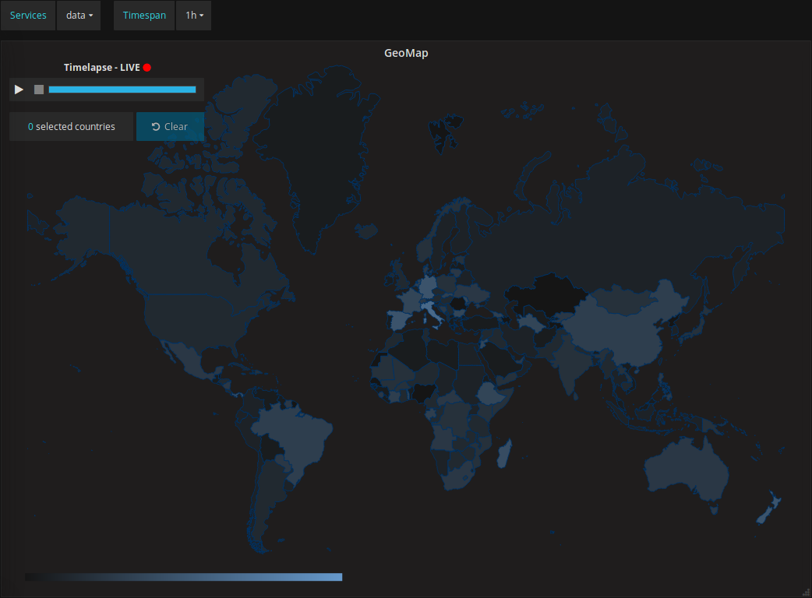
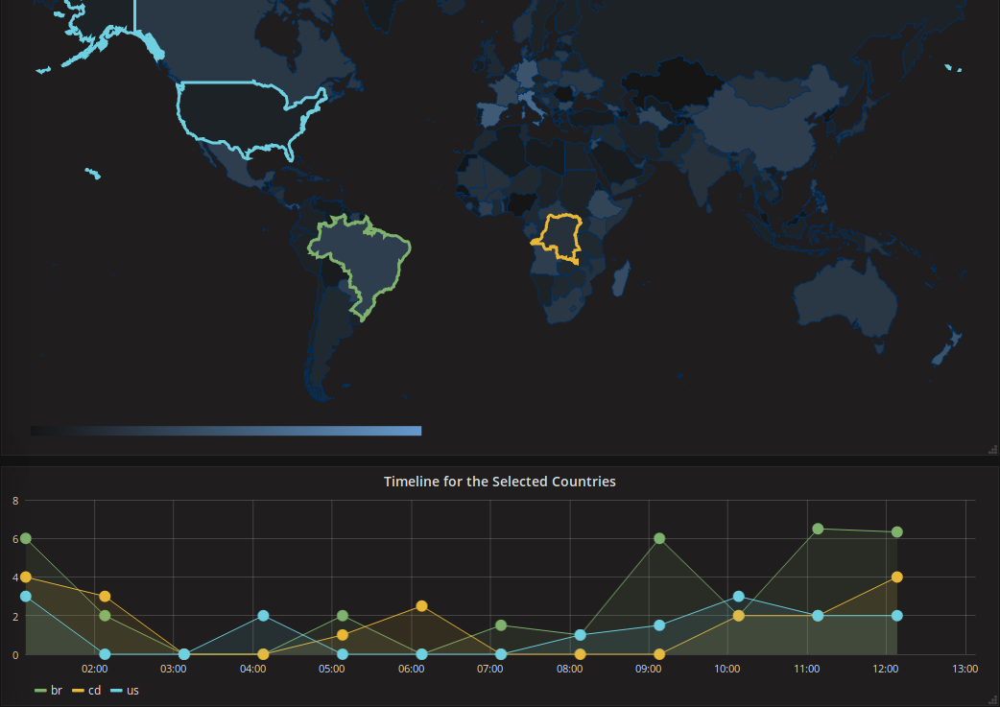
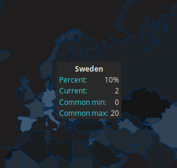
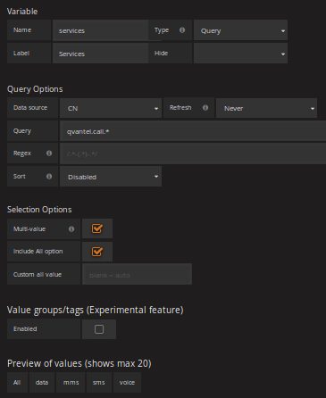
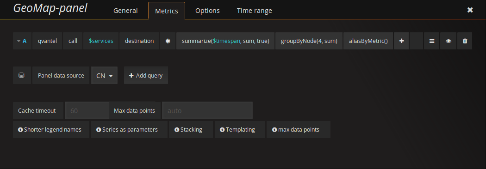
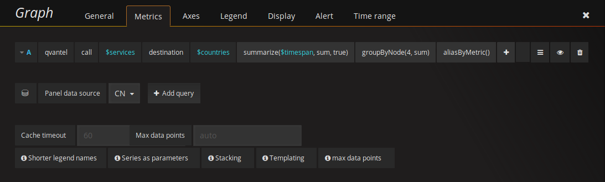
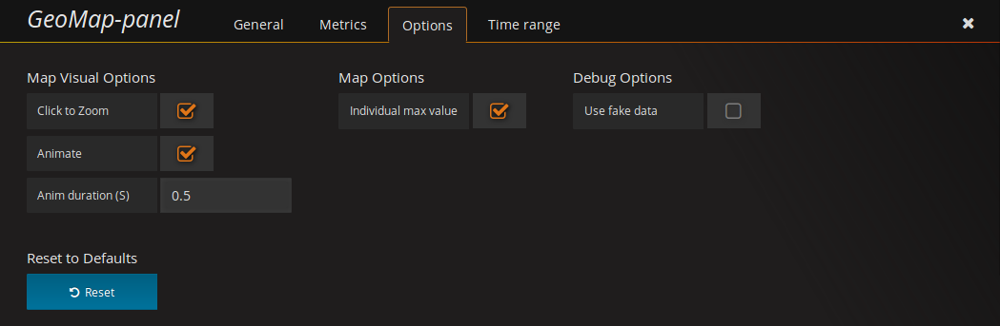
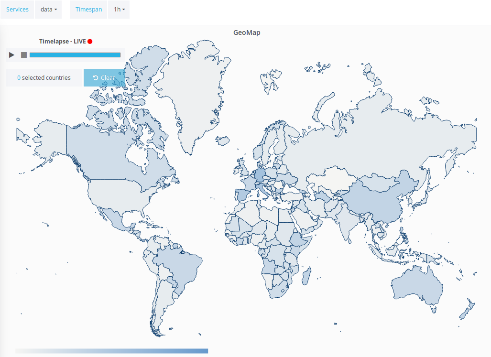

## GeoMap Panel plugin for Grafana

This plugin visualizes roaming service statistics (i.e data, mms, sms, voice) for each country in the world. This is achieved by using pathing within [D3.js](https://d3js.org/). The paths are retrieved by a TopJSON that's created from a shape file generated by the tool from [themathicmapping](http://thematicmapping.org/downloads/world_borders.php). The roaming service data is by default retrieved from a Graphite data source.

There is also a graph representing a timeline, where you more specifically can see the amount calls for the selected countries.

### How to use
When loading up the plugin, you'll initially see a world map with colorized countries (if data is present). The color (or heat if you will) of the country is calculated by comparing the country's most recent datapoint value with its maximum value in the time range selected in Grafana. There is also an option to compare countries with each other by using a common max value when calculating the heat. The heat is represented by a percentage value from 0% to 100%.

In the bottom left corner you'll see a legend with a color gradient. The color of each country can be found on this scale. The left hand side represents the color to be used when the country's heat is at 0% while the right hand side represents 100%.

You can hover over a country in order to retrieve more detailed information such as the country's heat percentage, current value, maximum value, minimum value and the trend over the selected timespan. The trend is calculated by using [simple linear regression](https://en.wikipedia.org/wiki/Simple_linear_regression).

You can also zoom into a country by left clicking on it. The world map will zoom to the center of the clicked country.

#### Selecting countries
You can select or deselect countries by holding the ctrl or shift key on your keyboard while left clicking on a country with your mouse. The selected countries will be displayed in the timeline graph panel. The selected countries on the world map will also get a colored border matching the color in the timeline graph so you easily can track which countries that has been selected and find the corresponding line in the graph. There is also a control panel in the top left corner which displays the amount of selected countries along side with a clear button which will deselect all selected countries.

#### Timelapse
In the top left corner you'll also find a control panel for a timelapse feature which will replay the selected timespan. In order to start a timelapse, click the start button and will from the beginning initialize the timelapse and start the replay. When then timelapse is in progress you have the option to pause or to stop it. When pausing the timelapse, the timelapse will stay idle on the current timestamp. If you press the stop button, the timelapse will stop and enter live mode. You can also control the timelapse by dragging the progress bar with the mouse. Dragging with the mouse lets you jump to specific time stamps.

#### Filtering
You can also in the top left corner see options to select or deselect services. Selecting services will filter the data by services, meaning only statistics for the selected services will be displayed. The currently available services are roaming calls via sms, voice, data and mms.

#### Aggregation
There is also an option, next to the services option, to select the wanted time aggregation. This will decide how aggregated the datapoints within the selected timespan will be. For example, if you select an aggregation of 2h in a timespan of 6h, you'll get 3 datapoints.

**The last two mentioned options will need to be manually setup using template variable, which will be explained below.**

### Templating
In order to filter the metrics in a more userfriendly way, we're using templates. A template is a variable accessable by all the panels in a dashboard. For this plugin, we're going to use 3 of them, one for services, one for the time aggregation and one for the selected countries. You will only need to add the service template and time aggregation templates, the worldmap plugin will dynamically handle the template variable for the selected countries.

In order to setup the template variables you'll first need to find the **cogwheel** (manage dashboard) in the top menu of the dashboard, clicking this will reveal a menu which includes the option **Templating**, select this option. Find the green **New** button and press it, it will direct you to where you add a new template variable. 

For the services template variable, we used the following information, keep in mind that some of the options will be relative to your data source:
1. Name: services
2. Label: Services
3. Type: query
4. Datasource: (select your data source)
5. Refresh: On Time Range Changed
6. Query: qvantel.call.* (make sure this matches your configuration)
7. Multi-value: true
8. Include All Option: true

*(note: you can also use the type custom and manually enter the services)*

For the time aggregation template variable, we used the following information:
1. Name: timespan
2. Label: Timespan
3. Type: custom
4. Values: 1h,6h,12h,1d,7d,14d,30d
5. Multi-value: false
6. Include All Option: false

*(note: we used the type custom instead of interval because snapshots don't seem to support intervals)*

### Metrics
In order to retrieve data to the plugin you'll need to setup a data source. The data source will need to send a country code and a value for that specific country. We currently only support a Graphite data source, other data sources may work, but we can't guarantee it.

To setup a data source, please refer to the [documentation](https://github.com/flygare/QvantelFrontend#data-source-setup) found in the repositories main readme.

#### Graphite query setup
When you have setup your Graphite data source, you'll need to go into the **Metrics** tab to alter the Graphite query, you'll need an admin account in order to see this tab.

##### The world map
The plugin will retrieve a set of data points for each country, the amount of data points depends on the time ranged specified within Grafana and how frequent Graphite retrieves data. 

In the metrics tab, you'll then need to add your template variable into the field pointing to the services template variable created above by entering the services template variable created above (**$services** in our case). 

To aggregate the data points with the template variable we created above, you'll need add the function **summarize**. For the first summarize parameter, enter the time aggregation template variable (**$timespan** in our case). For the second parameter, enter sum in order to aggregate by summarizing. The third parameter determines how to align the time periods ([documentation](http://graphite.readthedocs.io/en/latest/functions.html#graphite.render.functions.summarize)), here we want to select **true**. 

You also want to add the **groupByNode** pointing to the field cointaing the country code, this is to group all the services. And lastly, you want to add the function **aliasByMetric** in order to get the correct target (this will for example output se instead of qvantel.call.*service*.destionation.se).

##### The timeline graph
To setup the timeline, you'll need to as before, add the path to the data. In the field pointing to the services, again put in your template variable. In the field pointing to the country, you'll need to add a **$countries**. You don't need to add the countries variable in your templates as the world map plugin will handle this dynamically. You will here again need to add the **summarize**, **groupByNode** and the **aliasByMetric** functions with the same parameters explained above.

### Options
There are few options in order to manipulate the visualization of the map. These options can be accessed from the **Options** tab when editing the panel, you'll need an admin account in order to see this tab.

#### Click to zoom
Toggle wether you want to enable the zoom feature or not.

#### Animate
This option will let you turn on or off the animation of the countries colors. When a country recieves a new color, the animation will interpolate between the old and the new color.

#### Animation duration
The animation duration represents how long the animation will animate, in seconds. 

#### Individual max value
As default, this is set to true which will calculate the countrys heat by its own current and its own max value. If this however is set to false, the heat calculation will use the countries own current value and a common max value. The max value will be found by comparing all countries current value in order to find the maximum.

#### Use fake data
Instead of using data retrieved from the data source, you can enable fake data. This will randomly generate data within the client. This is mostly for debugging and testing purposes.

#### Reset button
Click the reset button if you want to set all settings to its default state.

### Grafana themes
The plugin will also respond to whether the user is using the Grafana pre-existing dark theme or respectively the light theme. The plugin will use a lighter color scheme if the user are using the light theme and a darker color scheme if the user are using the dark theme.

