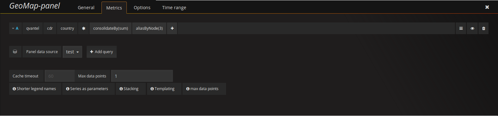

## GeoMap Panel plugin for Grafana

This plugin visualizes roaming calls for each country. This is achieved by using the map service from Google GeoCharts. The location data is retrieved from a Graphite data source.

### How to use
When loading up the plugin, you'll initially see a world map with colorized countries (if data is present). The color represents the frequency of a countrys roaming calls compared to the other countries currently displayed on the map. 

In the bottom left corner you'll see a legend with a color gradient, a minimum and a maximum value. The color of each country will be determined by using this scale. A country with a frequency closer to the minimum value will recieve a color close to the left hand side of the gradient.

A country's frequency can be more clearly seen by hovering the mouse hover a specific country, a popup will appear displaying its frequency of roaming calls. A country must have data in order for the popup to show.

### Metrics
In order to retrieve data to the plugin you'll need to setup a data source. The data source will need to send a country code and a value for that specific country. The value will represent the frequency of the country. We currently only support a Graphite data source, other data sources may work, but we can't guarantee it.

To setup a data source, please refer to documentation found in the repositories main readme: 

You'll then need to go into the **Metrics** tab to alter the Graphite query, you'll need an admin account in order to see this tab.

The plugin will retrieve a set of data points for each country, the amount depends on the time ranged specified within Grafana and how frequent Graphite retrieves data. As the plugin will summarize the value of each datapoint to its respective country, it's recommended to let Graphite summarize the data points, this is to take unecessary load off of the client. There are several ways to achieve this, but one way is to let the option **Max data points** to be set to **1** and then adding the **consolidateBy** function with the **sum** as parameter. This basically means that the plugin only wants 1 data point per country, and the overflow of data points should be summarized. You can alter this setting to your own needs, if you for example instead would want the **average**, **min** or **max** value of the country frequency.

For the plugin to work properly, you'll also need to use the **aliasByNode** function to point to the field containing the country code. This will let the plugin easily retrieve the country code.

### Options
There are several options in order to manipulate the visualization of the map. These options can be accessed from the **Options** tab when editing the panel, you'll need an admin account in order to see this tab.

#### Region
You can find a dropdown setting which let's you specify a continent. By doing so, the map will zoom in on the selected region.

#### Show legend
Here you can specify if you want the legend to be shown or not. When refering to "the legend", we mean the gradient in the bottom left corner of the map.

#### Animate
This option will let you turn on or off the animation of the countries colors. When a country recieves a new color, the animation will interpolate between the old and the new color.

#### Animation duration
The animation duration represents how long the animation will animate, in seconds. 

#### Color amount
The color amount option lets you specify how many colors to be used in the color gradient. The minimum value is **1** and the maxmimum value is **5**. Note that the first color in the gradient will always remain the same, this color is set depending on which theme that is used within Grafana.

#### Colors
Depending on how many colors you have selected in the previous option, that amount will decide how many color pickers that will be present within this option. Changing any of these colors will manipulate the color gradient. As mentioned in the previous option, the first color of the gradient will always be the same, depending on the theme used within Grafana.

### Grafana themes
The plugin will also respond to whether the user is using the Grafana pre-existing dark theme or respectively the light theme. The plugin will use a lighter color scheme if the user are using the light theme and a darker color scheme if the user are using the dark theme.

